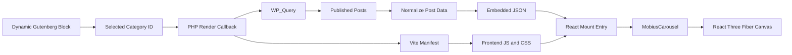

# AGENTS.md

## Project

`mobius-carousel` is a site-specific WordPress plugin that renders published WordPress posts as interactive cards arranged along a programmatically generated Möbius-strip carousel.

The public carousel is implemented with:

- TypeScript
- React
- Three.js
- React Three Fiber
- Vite

The repository produces an installable WordPress plugin ZIP.

## Target environment

```text
WordPress: 7.0.2
PHP: 8.2.26, 64-bit
Browsers: Modern browsers only
Package manager: pnpm
```

Do not add compatibility code for older WordPress, PHP, or browser versions.

## Scope

Repository work includes:

- Möbius-strip layout mathematics
- React Three Fiber carousel rendering
- Carousel card rendering and interaction
- TypeScript data interfaces
- Minimal Gutenberg block integration
- Server-side WordPress post retrieval
- Post-data normalization
- Vite build configuration
- Vite manifest loading from PHP
- Plugin ZIP packaging
- Tests, linting, and formatting

Do not include WordPress Dashboard usage instructions in this file.

## Architecture



WordPress retrieves and normalizes the posts on the server.

The browser receives the normalized carousel data with the rendered page. The initial carousel content must not require a WordPress REST API request.

## Repository structure

```text
mobius-carousel/
├── .github/
│   └── workflows/
│       └── deploy-demo.yml
├── AGENTS.md
├── index.html
├── README.md
├── package.json
├── pnpm-lock.yaml
├── tsconfig.json
├── vite.config.ts
├── vite.demo.config.ts
│
├── src/
│   ├── frontend/
│   │   ├── main.tsx
│   │   ├── MobiusCarousel.tsx
│   │   ├── MobiusCarouselScene.tsx
│   │   ├── MobiusCarouselCard.tsx
│   │   ├── ResponsiveCarouselCamera.tsx
│   │   ├── SelectedCardOverlay.tsx
│   │   ├── SelectedCardTransition.tsx
│   │   ├── carouselSlots.ts
│   │   ├── mobiusMath.ts
│   │   ├── useCarouselRotation.ts
│   │   └── styles.css
│   │
│   ├── demo/
│   │   ├── demo-card.png
│   │   ├── main.tsx
│   │   ├── mockItems.ts
│   │   └── styles.css
│   │
│   ├── editor/
│   │   ├── index.tsx
│   │   ├── styles.css
│   │   └── wordpress.d.ts
│   │
│   └── shared/
│       └── carousel.ts
│
├── wordpress-plugin/
│   ├── mobius-carousel.php
│   │
│   ├── block/
│   │   ├── block.json
│   │   └── render.php
│   │
│   ├── includes/
│   │   ├── posts.php
│   │   └── vite.php
│   │
│   └── dist/
│
├── scripts/
│   └── package-plugin.mjs
│
└── releases/
```

Preserve the separation between:

- public frontend code;
- minimal block-editor code;
- shared TypeScript definitions;
- WordPress PHP integration;
- generated Vite output;
- packaged release files.

Do not add a source media-assets directory unless the project acquires an actual plugin-owned media file.

## Content source

Each carousel instance displays published WordPress posts belonging to one category selected in the Gutenberg block.

Each post supplies:

| Carousel property | WordPress source                            |
| ----------------- | ------------------------------------------- |
| `id`              | Post ID                                     |
| `title`           | Post title                                  |
| `imageUrl`        | Featured image                              |
| `description`     | Post excerpt                                |
| `tags`            | Assigned tag names                          |
| `destinationUrl`  | Native custom field named `destination_url` |

All card images and content come from WordPress posts.

The plugin contains no bundled:

- card images;
- textures;
- 3D models;
- HDR environments;
- audio;
- content-specific media.

The Möbius geometry and visual structure are generated directly in code.

## Carousel data model

Define the frontend model in `src/shared/carousel.ts`.

```ts
export interface CarouselItem {
  id: number
  title: string
  imageUrl: string | null
  description: string
  tags: string[]
  destinationUrl: string | null
}
```

React components must consume this normalized structure.

Do not expose WordPress-specific response shapes, taxonomy objects, metadata structures, or PHP field names beyond the normalization boundary.

## Destination URL

The optional destination is stored through WordPress’s native Custom Fields mechanism.

The metadata key is:

```text
destination_url
```

The field may contain either:

- an internal URL from the same WordPress site;
- an external URL.

The plugin must treat both identically.

The plugin must not add a custom CTA meta box, Gutenberg sidebar panel, label field, target field, destination-type selector, or other post-editing interface.

Normalization rules:

- Missing field: `destinationUrl: null`
- Empty field: `destinationUrl: null`
- Invalid URL: `destinationUrl: null`
- Valid URL: sanitized URL string

The public card uses a fixed visible label:

```text
Open
```

Do not add `target="_blank"`. The link must behave as a normal browser link.

## Post retrieval

`wordpress-plugin/includes/posts.php` owns post querying and normalization.

The query must explicitly set:

- post type: `post`;
- post status: `publish`;
- selected category;
- deterministic ordering;
- sticky-post behavior;
- result count;
- child-category behavior.

Retrieve all matching posts. Return native sticky posts first, followed by non-sticky posts. Order each group by publication date descending with post ID descending as a deterministic tie-breaker. Match only the selected category and exclude child-category-only matches.

Do not rely on implicit `WP_Query` defaults for these decisions.

The normalization layer must retrieve:

- post ID;
- title;
- featured-image URL;
- excerpt;
- tag names;
- `destination_url` metadata.

Do not send full post content or raw Gutenberg HTML to the carousel.

Use the excerpt as the card description.

Missing images, excerpts, tags, or destination URLs must not cause rendering failure.

## Gutenberg block

Implement a dynamic, server-rendered Gutenberg block.

Its required configurable properties are:

```ts
interface MobiusCarouselBlockAttributes {
  categoryId: number
  visibleCardCount: number
  backgroundColor: string
}
```

The block editor must provide:

- a category selector;
- a positive-integer visual-card-count control with a default of `7`;
- a background-color control with a default of `#667889`;
- a small placeholder showing that the block is a Möbius Carousel;
- the selected category name when available.

The editor must not provide:

- an R3F preview;
- autoplay controls;
- height controls;
- camera controls;
- card-size controls;
- animation controls;
- unrelated styling panels;
- global editor modifications.

The editor entry must not import:

```text
three
@react-three/fiber
@react-three/drei
```

The editor entry uses WordPress-provided `window.wp` APIs and must not bundle a second React or Gutenberg runtime. It may register only the Möbius Carousel block and must not modify unrelated editor state or UI.

All editor styles must be scoped to the block.

The plugin must not alter unrelated WordPress editor behavior.

## Dynamic rendering

The PHP block renderer must:

1. Validate the category ID and background color.
2. Query matching published posts.
3. Normalize the posts into `CarouselItem[]`.
4. Generate a unique carousel instance ID.
5. Output a mount container.
6. Embed the normalized data as JSON.
7. Enqueue the public Vite entry.
8. Return valid output when no posts are found.

Multiple carousel blocks on the same page must be supported.

The frontend JavaScript and CSS must be enqueued only once per page.

## Frontend entry

`src/frontend/main.tsx` is the public browser entry.

It must:

1. Find every carousel mount container.
2. Read its embedded JSON payload.
3. Parse the payload safely.
4. Create one React root per container.
5. Render `MobiusCarousel`.
6. Isolate failures to the affected carousel instance.

Do not use global carousel state shared across independent block instances.

## React Three Fiber responsibilities

The public frontend owns:

- the `<Canvas>`;
- Möbius-strip parameterization;
- card positions and orientations;
- carousel movement;
- card interaction;
- active-card state;
- featured-image textures;
- title, description, and tag presentation;
- the fixed `Open` destination link;
- responsive layout;
- loading behavior;
- cleanup and disposal.

The carousel supports mouse-wheel rotation and horizontal pointer dragging with touch, pen, and the primary mouse button. Dragging must preserve vertical page scrolling, must not trigger card selection or deselection on release, and must use the existing damped continuous movement without snapping or release momentum.

Pointer interaction state must remain local to each carousel instance. Ignore secondary pointers, and clean up pointer capture when a gesture is cancelled, interaction is disabled, or the carousel unmounts.

Keep Möbius mathematics separate from React component rendering.

Prefer pure functions for converting a carousel parameter and item count into:

- position;
- orientation;
- scale;
- spacing.

Card dimensions and carousel proportions must be computed programmatically from the available data and container dimensions.

The number of visual card slots is configured per block and has no upper limit. Invalid, non-integer, or non-positive values fall back to `7`. Visual slots repeat carousel items when there are fewer items than slots and cycle through all items when there are more items than slots.

The carousel background color is configured per block as a valid opaque hexadecimal CSS color. Missing or invalid values fall back to `#667889`. Render the color as the Three.js scene background so the main canvas and the frosted-glass framebuffer use the same opaque background.

The carousel canvas must fill the width and height of its host container. The standalone demo and the public WordPress block host use `100svh` as their default height. Do not constrain the canvas itself to a square.

Use a perspective camera with a minimum vertical field of view of `12` degrees. In portrait canvases, increase the vertical field of view so the horizontal field of view remains `12` degrees. Do not modify Möbius geometry or card dimensions in response to the viewport aspect ratio.

Selected content divides the canvas into equal halves. Landscape canvases center the card and overlay at 25% and 75% of the canvas width. Portrait or square canvases center them at 25% and 75% of the canvas height.

Do not expose manual height or card-size settings through the block.

## Vite

`vite.config.ts` builds browser entries for WordPress. The plugin build does not build a standalone SPA and must not depend on `index.html`.

Use two entries:

```text
frontend → src/frontend/main.tsx
editor   → src/editor/index.tsx
```

Required build behavior:

- output into `wordpress-plugin/dist`;
- empty the generated output directory before building;
- generate a Vite manifest;
- use deployment-safe asset paths;
- bundle React, React DOM, Three.js, React Three Fiber, and required runtime dependencies;
- keep the editor bundle separate from the R3F frontend bundle;
- preserve imported CSS and generated chunks;
- never hard-code hashed output filenames in PHP.

`wordpress-plugin/dist` contains generated build assets such as:

```text
manifest.json
assets/frontend-[hash].js
assets/frontend-[hash].css
assets/editor-[hash].js
```

The term `assets` in this context means compiled JavaScript and CSS, not content media.

Do not edit files in `wordpress-plugin/dist` manually.

`vite.demo.config.ts` exclusively builds the standalone development demo from `index.html`. It must:

- use the deployment base `/mobius-carousel/`;
- output only to the repository-root `dist/` directory;
- include demo-only imports such as `src/demo/demo-card.png`;
- never write to, copy files into, or otherwise modify `wordpress-plugin/dist`;
- never be used by `pnpm build` or `pnpm package`.

The GitHub Pages workflow may upload only the repository-root `dist/` directory. Demo source files and demo build output must never be included in the WordPress plugin ZIP.

## WordPress plugin

`wordpress-plugin/mobius-carousel.php` must:

- contain the WordPress plugin header;
- declare WordPress 7.0 as the minimum version;
- declare PHP 8.2 as the minimum version;
- prevent direct execution;
- load the plugin modules;
- register the block;
- avoid unnecessary global symbols.

Use the prefix:

```text
mobius_carousel_
```

for PHP functions, handles, and internal identifiers.

The plugin must not register custom post types, custom taxonomies, custom post-editor panels, global editor extensions, or unrelated administrative features.

## Vite manifest integration

`wordpress-plugin/includes/vite.php` must:

- locate the generated manifest;
- decode it safely;
- resolve the frontend and editor entries;
- enqueue the appropriate JavaScript and CSS;
- avoid duplicate registrations;
- handle a missing or invalid manifest without a PHP fatal error;
- use module-script loading supported by WordPress 7.0.2;
- use file modification times or the plugin version for cache invalidation.

The public frontend entry must load only when a Möbius Carousel block is rendered.

The editor entry must load only where the block editor requires it.

## Security

Treat all WordPress content and block attributes as untrusted input.

Always:

- validate the category ID;
- validate the configured background color;
- sanitize the `destination_url` value;
- escape HTML attributes;
- escape visible PHP output;
- encode JSON using WordPress utilities;
- retrieve only published posts;
- avoid raw SQL when WordPress APIs are sufficient;
- prevent malformed metadata from reaching React as a valid URL.

Do not inject raw post HTML into the JSON payload.

## Package management

Use pnpm exclusively.

`package.json` must include an exact `packageManager` version.

Commit:

```text
pnpm-lock.yaml
```

Do not create or commit:

```text
package-lock.json
yarn.lock
bun.lock
```

Use strict TypeScript and declare every imported package as a direct dependency or development dependency as appropriate.

## Commands

The repository must support:

```bash
pnpm install
pnpm dev
pnpm lint
pnpm format
pnpm build
pnpm build:demo
pnpm preview:demo
pnpm package
```

Expected responsibilities:

```text
pnpm lint
    Check TypeScript, React, and repository source files.

pnpm format
    Format supported source and configuration files.

pnpm build
    Type-check and build the frontend and editor entries into
    wordpress-plugin/dist.

pnpm build:demo
    Type-check and build the standalone demo into the repository-root
    dist directory without changing wordpress-plugin/dist.

pnpm package
    Build the plugin ZIP at releases/mobius-carousel.zip.
```

## Plugin packaging

The generated archive must contain one plugin root directory:

```text
mobius-carousel.zip
└── mobius-carousel/
    ├── mobius-carousel.php
    ├── block/
    ├── includes/
    └── dist/
```

Do not include:

- `node_modules`;
- `.git`;
- repository source files;
- tests;
- local configuration files;
- development scripts;
- TypeScript configuration;
- Vite configuration;
- lockfiles.

The ZIP must contain everything required for WordPress to run the plugin without Node.js, npm, or pnpm on the server.

## Implementation order

1. Create the repository structure.
2. Define `CarouselItem`.
3. Implement Möbius layout mathematics with mock data.
4. Implement the R3F carousel and card rendering.
5. Implement multi-instance React mounting.
6. Configure Vite frontend and editor entries.
7. Create the WordPress plugin bootstrap.
8. Register the dynamic Gutenberg block.
9. Implement the minimal category selector.
10. Implement category-based post retrieval.
11. Normalize posts into `CarouselItem[]`.
12. Read `destination_url`.
13. Integrate manifest-based asset loading.
14. Add plugin packaging.
15. Test public rendering with one and multiple block instances.

## Coding rules

- Use TypeScript strict mode.
- Avoid `any`.
- Keep React components focused.
- Keep Möbius mathematics independent from rendering.
- Keep WordPress-specific logic in PHP.
- Keep the editor integration minimal and isolated.
- Do not add features not required by this document.
- Do not introduce configuration options without an explicit requirement.
- Do not add speculative abstraction layers.
- Do not edit generated files manually.
- Keep PHP normalization and TypeScript interfaces synchronized.
- Handle empty, malformed, single-item, and multi-item datasets safely.
